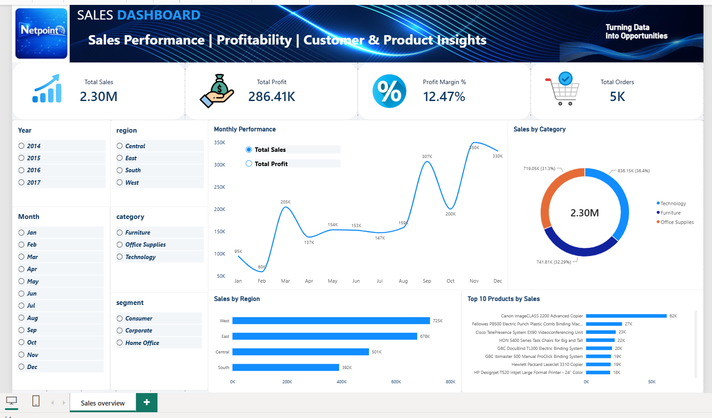

# Netpoint Power BI Data Analysis

An end-to-end data analysis project developed as part of the **Power BI Data Analysis Final Project at Netpoint**.

The project covers the complete data analysis workflow, starting from data cleaning and normalization, through SQL Server database creation and analysis, and ending with an interactive Power BI dashboard.

---

## 📊 Dashboard Preview



---

## 🛠️ Tools & Technologies

- **Power BI**
- **Power Query**
- **SQL Server**
- **SQL**
- **Excel**
- **Data Cleaning**
- **Data Normalization**
- **Data Modeling**
- **Star Schema**

---

## 🔄 Project Workflow

The project was completed through the following stages:

1. **Data Cleaning & Preparation**
   - Cleaned and prepared the raw dataset using Power Query.
   - Handled missing values and inconsistent data formats.
   - Removed duplicate records.
   - Standardized text and data types.
   - Corrected inconsistent date formats.

2. **Data Normalization**
   - Analyzed the structure of the dataset.
   - Separated the data into normalized tables.
   - Created relationships between the tables using primary and foreign keys.

3. **Database Creation**
   - Created a SQL Server database.
   - Created the normalized database tables.
   - Implemented primary keys and foreign keys.

4. **Data Loading**
   - Loaded the cleaned and normalized data into SQL Server.
   - Verified the loaded data using SQL queries.

5. **SQL Analysis**
   - Analyzed sales and profit performance.
   - Identified top customers and products.
   - Analyzed performance by region, category, state, year, month, and shipping mode.
   - Investigated loss-making products and sub-categories.
   - Analyzed profit margins and discount levels.

6. **Power BI Dashboard**
   - Connected Power BI to SQL Server.
   - Built a Star Schema for analytical reporting.
   - Created interactive KPIs, charts, and slicers.
   - Added a metric parameter to switch between Sales and Profit.
   - Designed an interactive Sales Overview dashboard.

---

## 🗄️ Database Structure

The normalized database consists of five main tables:

### Customers
- `customer_id` — Primary Key
- `customer_name`
- `segment`

### Locations
- `location_key` — Primary Key
- `postal_code`
- `city`
- `state`
- `country`
- `region`

### Products
- `products_key` — Primary Key
- `product_id`
- `product_name`
- `category`
- `sub_category`

### Orders
- `order_id` — Primary Key
- `order_date`
- `ship_date`
- `ship_mode`
- `customer_id` — Foreign Key
- `location_key` — Foreign Key

### Order Details
- `order_detail_id` — Primary Key
- `order_id` — Foreign Key
- `products_key` — Foreign Key
- `sales`
- `quantity`
- `discount`
- `profit`

---

## ⭐ Power BI Data Model

The Power BI analytical model uses a Star Schema consisting of:

- `dim_customer`
- `dim_product`
- `dim_location`
- `fact_sales`

Relationships connect the dimension tables to the `fact_sales` table through their corresponding keys.

---

## 📈 Dashboard Features

The dashboard provides:

- Total Sales
- Total Profit
- Profit Margin %
- Total Orders
- Sales by Region
- Sales by Category
- Top 10 Products by Sales
- Monthly Sales & Profit Performance
- Interactive Year filtering
- Region filtering
- Month filtering
- Category filtering
- Segment filtering
- Sales/Profit metric selection

---

## 🔍 SQL Analysis

The SQL analysis includes:

- Sales and Profit by Region
- Top 10 Customers by Sales
- Top 10 Products by Sales
- Sales and Profit by Ship Mode
- Sales and Profit by Year
- Sales and Profit by Month
- Sales and Profit by Year and Month
- Loss-Making Sub-Categories
- Top 10 Loss-Making Products
- Profit Margin by Category
- Average Discount by Category
- Top 10 Customers by Profit
- Top 10 States by Sales
- Average Order Value by Segment
- Profit by Discount Level

---

## 📁 Project Structure

```text
netpoint-powerbi-data-analysis/
│
├── Sql/
│   ├── database_creation.sql
│   ├── data_loading.sql
│   └── sql_analysis.sql
│
├── data/
│   ├── Customer.csv
│   ├── locations.csv
│   ├── orderDetails.csv
│   ├── orders.csv
│   └── products.csv
│
├── README.md
├── Sales_Dashboard.pbix
└── dashboard.png
